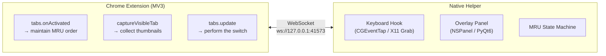

<p align="center">
  
</p>

<h3 align="center">TabCircle</h3>

<p align="center">
  <strong>Supercharge Chrome's tab experience — MRU switching, tab management, and pins that persist.</strong><br>
  Hold <kbd>Ctrl</kbd> and tap <kbd>Tab</kbd> to move through tabs in the order you used them.
</p>

<p align="center">
  <a href="https://github.com/sniperravan/TabCircle/stargazers"></a>
  
  
  
  <a href="./LICENSE"></a>
</p>

<p align="center">
  <a href="#installation">🚀 <strong>Get Started</strong></a> ｜ <a href="https://github.com/sniperravan/TabCircle">📦 <strong>GitHub</strong></a>
</p>

---

Chrome cycles tabs in tab-strip order. TabCircle makes `Ctrl + Tab` cycle them by recent use and shows a switcher overlay while you hold the key, the same way `Cmd + Tab` (`⌘ + ⇥`) works for applications.

## Features

- `Ctrl + Tab` (`⌃ + ⇥`) switches to the tab you used last
- Tapping `Ctrl + Tab` again returns to where you started, so A↔B toggling stays stable
- Every tab in the list carries a live page thumbnail
- Keyboard (`Ctrl + Tab`, `Ctrl + Shift + Tab`), arrow keys and mouse clicks all drive the switcher
- Two switcher layouts: a horizontal strip, or an adaptive grid that fits every tab on one screen
- The overlay is centered on the Chrome window in use, across multiple displays
- Light and dark appearance follow the system setting
- In-app updates — checks GitHub Releases on a schedule you pick and installs in place after one click
- If the helper or extension is unavailable, `Ctrl + Tab` falls back to Chrome's built-in behavior

## How it works

TabCircle runs as two parts that talk over a loopback WebSocket:



Both halves are required:

- **The extension cannot read the keyboard.** `Tab` was removed from the supported-key list of `chrome.commands` in Chrome 33, so no extension can bind `Ctrl + Tab`.
- **The helper cannot read the tabs.** Titles, MRU order, thumbnails and switching all go through the `chrome.tabs` API.

## Installation

### 1. Load the Browser Extension (All Platforms)

1. Open `chrome://extensions` or `brave://extensions` in your browser.
2. Toggle on **Developer mode** in the top-right corner.
3. Click **Load unpacked** (note: Chromium browsers require an extracted directory and cannot load `.zip` archives directly).
4. If downloading from GitHub Releases, unzip `TabCircle-Extension.zip` into a permanent directory (e.g. `~/Documents/TabCircle-Extension`) and select the `TabCircle-Extension/` folder. If working from source, select the `extension/` repository folder.

---

### 2. Linux Setup (X11)

#### Requirements
- Python 3.9+
- X11 session (Cinnamon, GNOME on Xorg, KDE Plasma, XFCE, MATE, etc.)
- Chromium browser (Brave, Chrome, Edge, Chromium, Vivaldi)

#### Quick Automated Install (Recommended)
Clone the repository and run the setup script:

```bash
git clone https://github.com/sniperravan/TabCircle.git
cd TabCircle
./scripts/install-linux.sh
```

This installs the required dependencies (`PyQt6`, `python-xlib`, `websockets`), registers an autostart desktop entry (`~/.config/autostart/tabcircle.desktop`), and launches the helper in the background.

*To check status or uninstall:*
```bash
./scripts/install-linux.sh --status
./scripts/install-linux.sh --uninstall
```

#### Low-Resource / Favicon-Only Mode
For users on battery, lightweight laptops, or systems with weaker CPUs, you can disable viewport screenshot captures while keeping the full MRU tab switcher functionality:
- **What it saves**: Eliminates browser-side CPU spikes on tab switches (completely bypasses `chrome.tabs.captureVisibleTab`, canvas allocations, and JPEG encoding) and saves ~2.5–5MB of image cache.
- **What it does NOT change**: The Python helper baseline memory (~50–80MB RSS) remains standard, as it is consumed by the Python runtime, PyQt6, Qt rendering libraries, and X11 bindings.
- **Automated setup**: Run `./scripts/install-linux.sh --low-resource` (or `./scripts/install-linux.sh --restart` to apply)
- **Manual CLI**: Pass `--low-resource` (or `--no-low-resource` to force standard mode):
  ```bash
  python3 linux-helper/app.py --low-resource
  ```
- **Configuration file**: Set `"low_resource_mode": true` in `~/.config/tabcircle/config.json`:
  ```json
  {
    "low_resource_mode": true
  }
  ```
- **Precedence**: CLI flag (`--low-resource` / `--no-low-resource`) > Configuration file (`config.json`) > Default (`false`).
*(Note: If you edit `config.json` manually while the daemon is running, restart it with `./scripts/install-linux.sh --restart` or click reload on the extension in `chrome://extensions`.)*

#### Manual Execution
If you prefer running without session autostart:

```bash
pip install -r linux-helper/requirements.txt
python3 linux-helper/app.py
```

---

### 3. macOS Setup

#### Requirements
- macOS 14 or later
- Google Chrome 116 or later
- Xcode Command Line Tools (source build only) — `xcode-select --install`

#### Option A — Download the app (recommended)

1. Grab the DMG for your Mac from [Releases](https://github.com/sniperravan/TabCircle/releases/latest): `arm64` for Apple Silicon, `x86_64` for Intel
2. Drag **TabCircle.app** into **Applications** and launch it — a guided overlay walks you through granting Accessibility permission
3. Load the extension (Step 1 above)
4. Done. Future versions update themselves via GitHub Releases.

#### Option B — Build from source

```bash
cd helper
swift build -c release
./.build/release/tabcircle
```

### 4. Grant Accessibility permission

The helper installs a `CGEventTap` to intercept `Ctrl + Tab` (`⌃ + ⇥`) before Chrome receives it, which requires Accessibility access.

Start it once:

```bash
./.build/release/tabcircle
```

macOS shows a permission prompt. Grant access to the app that launched the binary (Terminal, iTerm, and so on), then quit that app completely and reopen it — permissions are read at process launch.

If `CGEvent.tapCreate` still fails, enable the same app under **System Settings → Privacy & Security → Input Monitoring** as well.

### 5. Run

```bash
./.build/release/tabcircle
```

Startup output:

```
[HH:MM:SS.mmm] tabcircle started — binary built ...
[HH:MM:SS.mmm] WebSocket server listening → ws://127.0.0.1:41573/
[HH:MM:SS.mmm] Keyboard hook installed — waiting for Ctrl+Tab in Chrome
[HH:MM:SS.mmm] ✅ Extension connected (1 client(s))
```

The last line confirms the extension reached the helper.

## Usage

### Shortcuts

| Action | Result |
|---|---|
| Tap `Ctrl + Tab` and release | Switch to the previously used tab |
| Tap `Ctrl + Tab` twice | Return to the tab you started from |
| Hold `Ctrl`, tap `Tab` repeatedly | Move further back through the history |
| Hold `Ctrl`, press `Ctrl + Shift + Tab` | Move forward |
| Hold `Ctrl`, press `←` or `→` | Move the cursor with arrow keys |
| Hold `Ctrl`, press `↑` or `↓` | Move by row (grid layout) |
| Hold `Ctrl`, click a card | Switch to that tab immediately |
| Hold `Ctrl`, hover a card | Move the cursor with the mouse |

The overlay appears when you press `Tab` and closes when you release `Ctrl`. A single quick tap flashes it briefly, matching the behaviour of `Cmd + Tab` (`⌘ + ⇥`).

### Settings

Open the settings window from the menu bar icon (**Settings…**, or `⌘ + ,` while a TabCircle window is focused) or by clicking the TabCircle icon in the Chrome toolbar. Changes take effect immediately — nothing needs to restart.

| Setting | Default | Effect |
|---|---|---|
| Limit switching to the current window | On | The switcher lists only the tabs of the Chrome window in use. Turn it off to cycle through every window's tabs in one list. |
| Switcher layout | Horizontal strip | Grid wraps the cards so every tab fits on one screen; `Ctrl + ↑` / `Ctrl + ↓` then move by row. |
| Check for updates | Daily | Automatic update checks: daily / weekly / never. Updates download, install in place, and relaunch after you confirm. |
| Language / Appearance / Open at Login | — | Interface language, light/dark override, launch at login. |

Each window keeps its own history either way. Switching the scope setting off merges the lists for display; it does not discard anything.

### Tab ordering

The list has two sections:

1. **Tabs visited this session** — sorted by last visit, most recent first
2. **Tabs never opened** — restored sessions and background links, listed after the first section in tab-strip order

A freshly started helper has an empty first section, so the list initially matches tab-strip order. It reorders itself as you browse.

### Thumbnails

`captureVisibleTab` only captures the visible tab, so TabCircle takes a screenshot each time a tab becomes active. Every tab in the MRU list has been active at some point, so thumbnails accumulate through normal use.

`chrome://` pages and the Chrome Web Store cannot be captured — Chrome blocks it. Those cards show the favicon.

## Troubleshooting

Start with the helper log:
- **Linux**: `~/.cache/tabcircle/helper.log` (automatically rotated up to 15MB, also printed to terminal stdout)
- **macOS**: `~/Library/Logs/TabCircle/tabcircle.log` (also printed to terminal stdout)

Tab cache storage:
- **Linux**: `/tmp/tabcircle/tabs_cache.json` (instant tab recovery on restart, managed in system temp directory)

### Ctrl + Tab does nothing

Look for `✅ Extension connected` in the log.

- **Line missing** — the extension is not reaching the helper. Confirm the helper process is running and the extension is enabled in `chrome://extensions`.
- **Line present, native switching still happens** — the connection dropped afterwards. TabCircle passes `Ctrl + Tab` through to Chrome whenever it is disconnected, so Chrome's own switching is the expected fallback.

### `CGEvent.tapCreate failed`

Accessibility permission is missing or stale. Follow step 4 of the installation. The terminal app must be quit completely (`⌘ + Q`, not just closing the window) before a newly granted permission applies.

### Code changes have no effect

The helper does not hot-reload.

- **Helper changes** — the first log line prints the binary's build time. If it predates your last build, a stale process is still running; stop it and start again.
- **Extension changes** — click ↻ on the extension card in `chrome://extensions`.

### Chrome warns about developer-mode extensions

Chrome shows this notice for any unpacked extension. It does not affect TabCircle.

### The overlay opens on the wrong display

The overlay follows the frontmost Chrome window. With windows on several displays, the active display is dynamically detected via XRandR output matching.

### Linux: Cinnamon "Locate Pointer" Interaction

On Cinnamon desktops with "Show position of pointer when the Control key is pressed" (`locate-pointer`) enabled, Cinnamon places a synchronous grab on `Control` at the root window. When `Ctrl + Tab` is pressed, Cinnamon replays the event via `XReplayKeyboard`, which by X11 specification skips root-level passive grabs.

TabCircle implements **dynamic window-targeted passive grabs** attached directly to the active browser window upon focus changes (`_NET_ACTIVE_WINDOW`), ensuring native interception. If you ever experience issues on older desktop environments:
```bash
gsettings set org.cinnamon.desktop.peripherals.mouse locate-pointer false
```

## Acknowledgements & Inspirations

TabCircle draws inspiration from:
- **macOS `Cmd + Tab` (`⌘ + ⇥`) & Arc Browser**: The fluid, responsive visual layout, typography, and card-based overlay design principles that make fast keyboard navigation feel native and effortless.
- **Native Extension Companions**: Pairing MV3 browser extensions with native system daemons to achieve low-latency MRU tab switching with synchronous event interception and continuous squircle geometry.

## License

[MIT License](./LICENSE) © [sniperravan](https://github.com/sniperravan)
