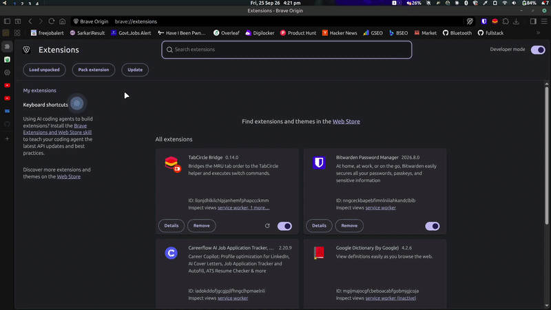
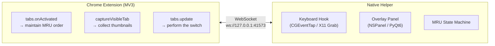

<p align="center">
  
</p>

<h3 align="center">TabCircle</h3>

<p align="center">
  <strong>Supercharge Chrome's tab experience — MRU switching, live previews, and instant navigation.</strong><br>
  Hold <kbd>Ctrl</kbd> and tap <kbd>Tab</kbd> to move through tabs in the order you used them.
</p>

<p align="center">
  <a href="https://github.com/sniperravan/TabCircle/stargazers"></a>
  
  
  
  <a href="./LICENSE"></a>
</p>

<p align="center">
  <a href="#installation">🚀 <strong>Get Started</strong></a> ｜ <a href="https://github.com/sniperravan/TabCircle">📦 <strong>GitHub</strong></a>
</p>

---

<p align="center">
  
</p>

Chrome cycles tabs in tab-strip order. TabCircle makes `Ctrl + Tab` cycle them by recent use and shows a switcher overlay while you hold the key, the same way `Cmd + Tab` (`⌘ + ⇥`) works for applications.

## Features

- **MRU Tab Switching**: `Ctrl + Tab` (`⌃ + ⇥`) switches to the tab you used last; tapping it again returns to where you started for rock-solid A↔B toggling
- **Visual Previews**: Live page thumbnails with squircle geometry, or lightweight favicon-only mode for low-resource environments
- **Full Navigation Control**: Keyboard (`Ctrl + Tab`, `Ctrl + Shift + Tab`), arrow keys, and mouse hover/clicks all drive the switcher
- **Multi-Monitor Display Awareness**: Overlay centers dynamically over the active browser window on multi-monitor setups
- **Adaptive Theming**: Automatically tracks browser and system light/dark mode
- **Switcher Layouts**: Horizontal strip on Linux and macOS; adaptive multi-row grid on macOS (Linux grid on roadmap)
- **Update Checks**: In-app 1-click updates with schedule picker on macOS; background release checking with desktop notifications and manual check CLI on Linux
- **Graceful Fallback**: If the helper or extension drops, `Ctrl + Tab` transparently falls back to Chrome's native behavior without blocking keystrokes

## How it works

TabCircle runs as two parts that talk over a loopback WebSocket:



Both halves are required:

- **The extension cannot read the keyboard.** `Tab` was removed from the supported-key list of `chrome.commands` in Chrome 33, so no extension can bind `Ctrl + Tab`.
- **The helper cannot read the tabs.** Titles, MRU order, thumbnails and switching all go through the `chrome.tabs` API.

## Installation

Grab the files you need from [Releases](https://github.com/sniperravan/TabCircle/releases/latest) — no need to clone the repo.

| File | What it is | Get it on |
|---|---|---|
| `TabCircle-Extension.zip` | The Chrome extension (unpacked folder: `manifest.json`, `background.js`, icons) | **Linux and macOS** |
| `tabcircle-linux.tar.gz` | The Linux helper daemon + `install-linux.sh` | **Linux only** |
| `TabCircle-<version>-arm64.dmg` | macOS app, Apple Silicon | **macOS (M1/M2/M3/M4)** |
| `TabCircle-<version>-x86_64.dmg` | macOS app, Intel | **macOS (Intel)** |

### 1. Load the browser extension (both platforms)

1. Download and unzip `TabCircle-Extension.zip` somewhere permanent — e.g. `~/Documents/TabCircle-Extension` (moving or deleting this folder later will break the extension).
2. Open `chrome://extensions` (or `brave://extensions`) and enable **Developer mode**.
3. Click **Load unpacked** and select the unzipped `TabCircle-Extension/` folder.

### 2a. Linux setup (X11)

**Requires:** Python 3.9+, an X11 session (Cinnamon, GNOME on Xorg, KDE, XFCE, MATE), a Chromium-based browser.

```bash
# Download tabcircle-linux.tar.gz from the Releases page, then:
tar -xzf tabcircle-linux.tar.gz
cd tabcircle-linux
./scripts/install-linux.sh
```

This installs `PyQt6`, `python-xlib`, and `websockets`; registers autostart at `~/.config/autostart/tabcircle.desktop`; and starts the helper.

```bash
./scripts/install-linux.sh --status         # check it's running
./scripts/install-linux.sh --check-updates  # check for newer releases
./scripts/install-linux.sh --uninstall      # remove it
```

<details>
<summary>Run manually instead (no autostart)</summary>

```bash
pip install -r linux-helper/requirements.txt
python3 linux-helper/app.py
```
</details>

<details>
<summary>Low-resource mode (favicon-only, for weaker CPUs/battery)</summary>

Disables screenshot capture on tab switch. Saves browser-side CPU during switching; does **not** reduce the helper's own ~50–80MB baseline (that's Python/Qt/X11, not thumbnails).

```bash
./scripts/install-linux.sh --low-resource
# or toggle later and apply with:
./scripts/install-linux.sh --restart
```

Precedence: `--low-resource`/`--no-low-resource` CLI flag > `~/.config/tabcircle/config.json` (`{"low_resource_mode": true}`) > default (off).
</details>

<details>
<summary>Building from source instead</summary>

```bash
git clone https://github.com/sniperravan/TabCircle.git
cd TabCircle
./scripts/install-linux.sh
```
</details>

### 2b. macOS setup

**Requires:** macOS 14+, Chrome 116+.

1. Download the DMG matching your Mac (`arm64` for Apple Silicon, `x86_64` for Intel) from [Releases](https://github.com/sniperravan/TabCircle/releases/latest).
2. Open the DMG and drag `TabCircle.app` to Applications.
3. **First launch:** these builds aren't notarized by Apple, so Gatekeeper will block a normal double-click. Instead, **right-click `TabCircle.app` → Open**, then confirm in the dialog that appears. You only need to do this once. (If macOS still refuses, run `xattr -d com.apple.quarantine /Applications/TabCircle.app` in Terminal, then try again.)
4. A guided overlay walks you through granting **Accessibility** access — needed because the helper intercepts Ctrl+Tab before Chrome sees it.
5. Load the extension (Step 1 above). Future versions update themselves via GitHub Releases.

<details>
<summary>Building from source instead</summary>

Requires Xcode Command Line Tools (`xcode-select --install`).

```bash
git clone https://github.com/sniperravan/TabCircle.git
cd TabCircle/helper
swift build -c release
./.build/release/tabcircle
```

On first launch, macOS prompts for Accessibility access. Grant it to whatever launched the binary (Terminal, iTerm, etc.), then **fully quit and relaunch that app** — permissions are only read at process start. If `CGEvent.tapCreate` still fails, also enable it under **System Settings → Privacy & Security → Input Monitoring**.

A successful run looks like:
```
[HH:MM:SS.mmm] tabcircle started — binary built ...
[HH:MM:SS.mmm] WebSocket server listening → ws://127.0.0.1:41573/
[HH:MM:SS.mmm] Keyboard hook installed — waiting for Ctrl+Tab in Chrome
[HH:MM:SS.mmm] ✅ Extension connected (1 client(s))
```
</details>


## Usage

### Shortcuts

| Action | Result |
|---|---|
| Tap `Ctrl + Tab` and release | Switch to the previously used tab |
| Tap `Ctrl + Tab` twice | Return to the tab you started from |
| Hold `Ctrl`, tap `Tab` repeatedly | Move further back through the history |
| Hold `Ctrl`, press `Ctrl + Shift + Tab` | Move forward |
| Hold `Ctrl`, press `←` or `→` | Move the cursor with arrow keys |
| Hold `Ctrl`, press `↑` or `↓` | Move by row (macOS grid layout) |
| Hold `Ctrl`, click a card | Switch to that tab immediately |
| Hold `Ctrl`, hover a card | Move the cursor with the mouse |

The overlay appears when you press `Tab` and closes when you release `Ctrl`. A single quick tap flashes it briefly, matching the behaviour of `Cmd + Tab` (`⌘ + ⇥`).

### Settings

#### macOS
Open the graphical settings window from the menu bar icon (**Settings…**, or `⌘ + ,` while a TabCircle window is focused) or by clicking the TabCircle icon in the Chrome toolbar. Changes take effect immediately — nothing needs to restart.

| Setting | Default | Effect |
|---|---|---|
| Limit switching to the current window | On | The switcher lists only the tabs of the Chrome window in use. Turn it off to cycle through every window's tabs in one list. |
| Switcher layout | Horizontal strip | Grid wraps the cards so every tab fits on one screen; `Ctrl + ↑` / `Ctrl + ↓` then move by row. |
| Check for updates | Daily | Automatic update checks: daily / weekly / never. Updates download, install in place, and relaunch after you confirm. |
| Language / Appearance / Open at Login | — | Interface language, light/dark override, launch at login. |

Each window keeps its own history either way. Switching the scope setting off merges the lists for display; it does not discard anything.

#### Linux
Linux does not have a GUI settings window yet. Configuration is managed via CLI flags and `~/.config/tabcircle/config.json`:

- **Low-resource mode** (disables screenshot thumbnails, uses crisp vector favicons): pass `--low-resource` or set `"low_resource_mode": true` in `~/.config/tabcircle/config.json`.
- **Custom browser forks**: add `"extra_browser_classes": ["my-custom-fork"]` in `~/.config/tabcircle/config.json` to recognize unlisted Chromium derivatives without code changes.
- **Update checks**: automatic daily background check against GitHub Releases with desktop notifications; check manually anytime via `./scripts/install-linux.sh --check-updates`.

*(Note: Clicking the TabCircle extension toolbar icon on Linux logs configuration guidance to the helper log rather than opening a settings window.)*

### Tab ordering

The list has two sections:

1. **Tabs visited this session** — sorted by last visit, most recent first
2. **Tabs never opened** — restored sessions and background links, listed after the first section in tab-strip order

A freshly started helper has an empty first section, so the list initially matches tab-strip order. It reorders itself as you browse.

### Thumbnails

`captureVisibleTab` only captures the visible tab, so TabCircle takes a screenshot each time a tab becomes active. Every tab in the MRU list has been active at some point, so thumbnails accumulate through normal use.

`chrome://` pages and the Chrome Web Store cannot be captured — Chrome blocks it. Those cards show the favicon.

## Troubleshooting

Start with the helper log:
- **Linux**: `~/.cache/tabcircle/helper.log` (automatically rotated up to 15MB, also printed to terminal stdout)
- **macOS**: `~/Library/Logs/TabCircle/tabcircle.log` (also printed to terminal stdout)

Tab cache storage:
- **Linux**: `/tmp/tabcircle/tabs_cache.json` (instant tab recovery on restart, managed in system temp directory)

### Ctrl + Tab does nothing

Look for `✅ Extension connected` in the log.

- **Line missing** — the extension is not reaching the helper. Confirm the helper process is running and the extension is enabled in `chrome://extensions`.
- **Line present, native switching still happens** — the connection dropped afterwards. TabCircle passes `Ctrl + Tab` through to Chrome whenever it is disconnected, so Chrome's own switching is the expected fallback.

### `CGEvent.tapCreate failed`

Accessibility permission is missing or stale. Follow step 4 of the installation. The terminal app must be quit completely (`⌘ + Q`, not just closing the window) before a newly granted permission applies.

### Code changes have no effect

The helper does not hot-reload.

- **Helper changes** — the first log line prints the binary's build time. If it predates your last build, a stale process is still running; stop it and start again.
- **Extension changes** — click ↻ on the extension card in `chrome://extensions`.

### Chrome warns about developer-mode extensions

Chrome shows this notice for any unpacked extension. It does not affect TabCircle.

### The overlay opens on the wrong display

The overlay follows the frontmost Chrome window. With windows on several displays, the active display is dynamically detected via XRandR output matching.

### Linux: Cinnamon "Locate Pointer" Interaction

On Cinnamon desktops with "Show position of pointer when the Control key is pressed" (`locate-pointer`) enabled, Cinnamon places a synchronous grab on `Control` at the root window. When `Ctrl + Tab` is pressed, Cinnamon replays the event via `XReplayKeyboard`, which by X11 specification skips root-level passive grabs.

TabCircle implements **dynamic window-targeted passive grabs** attached directly to the active browser window upon focus changes (`_NET_ACTIVE_WINDOW`), ensuring native interception. If you ever experience issues on older desktop environments:
```bash
gsettings set org.cinnamon.desktop.peripherals.mouse locate-pointer false
```

### Wayland

TabCircle's Linux helper uses X11 passive grabs (`python-xlib`) to intercept `Ctrl + Tab`.
- **Default Browsers on Wayland (XWayland)**: By default, Chrome, Brave, and Edge run through **XWayland** on most Linux desktops (GNOME, KDE Plasma), exposing a real X11 window. In this configuration, TabCircle works out of the box without any extra steps.
- **Native Wayland Clients**: If your browser is launched as a native Wayland client (e.g. `--ozone-platform=wayland` or the `chrome://flags` ozone platform flag set to Wayland), X11 cannot see its window or keystrokes.
  - **Fix**: Launch your browser with the XWayland platform flag:
    ```bash
    google-chrome --ozone-platform=x11
    # or for Brave:
    brave-browser --ozone-platform=x11
    ```
    You can also add `--ozone-platform=x11` to your browser's `.desktop` launcher in `~/.local/share/applications/`.
  - *Note*: Automatic detection of native-Wayland browser windows is not yet implemented. If Ctrl+Tab stops working after a browser update, check whether your browser switched to native Wayland mode.
- **Roadmap**: True global shortcuts on native Wayland require compositor portal protocols (`org.freedesktop.portal.GlobalShortcuts` via D-Bus). This is tracked for future architectural updates.

## Acknowledgements & Inspirations

TabCircle draws concept inspiration from:
- **[TabFlick](https://github.com/lifedever/TabFlick)** by lifedever: Pioneered the concept of pairing an MV3 Chromium browser extension with a native companion daemon for fast MRU tab switching on macOS. TabCircle takes this workflow inspiration and reimplements/evolves the system natively for Linux (X11, PyQt6, Chromium/Brave) and macOS with continuous squircle geometry, hardware display matching, and low-resource modes.
- **macOS `Cmd + Tab` (`⌘ + ⇥`) & Arc Browser**: The fluid, responsive visual layout, typography, and card-based overlay design principles.

## Author & License

- **Author & Maintainer**: [Sniper Ravan](https://github.com/SniperRavan)
- **License**: [MIT License](./LICENSE) © 2026 [sniperravan](https://github.com/sniperravan)
